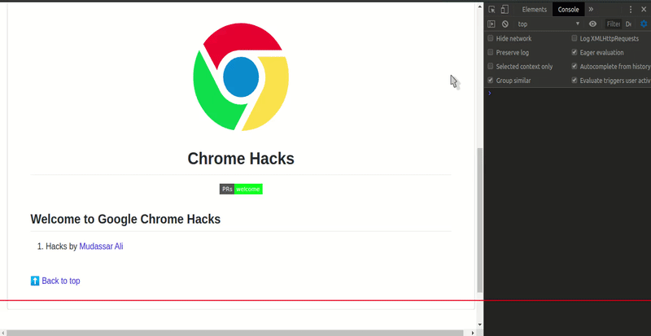

<h1 align="center"> Hacks by <a href="https://github.com/mudassar045" target="_blank">Mudassar</a></h1>

Here's the list of [gHacks](./README.md) which I used the most.

### DevTools' Dark Mode

Follow the steps to activate `Dark Mode`

- Open DevTools
- Press 'F1' to open `Settings` window for  DevTools
- Go to Preferences > Appearance
- Change theme `default` to `dark`
- Hurrah! 🥳, Enjoy the *darkness of DevTools* 🌑

### Design Mode of Web Page

Tired by refreshing while designing web page, follow the steps to `on` design mode

- Open console and the write script below and press `enter` key

    > document.designMode = "on"

- Set `off` to make design mode off

- Check out the demo

### Screenshort of Web Page

Do you oftent take `screenshort` to share something with others, here's how you can take

- Open chrome browser `console`
- Press combination `CTRL` + `SHIFT` + `P`
- Type action `Screenshot`
- Select the disered option for capturing screen ()
- Captured screenshot will be downloaded with `.png` extension 🥳

 

[:arrow_up: Back to top](#-hacks-by-mudassar-)
